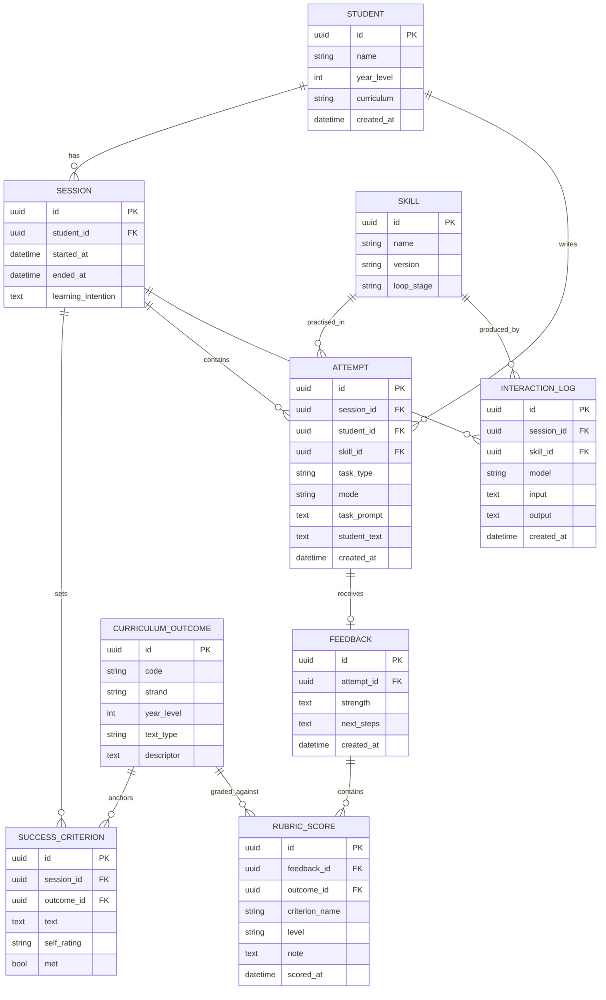

# English Tutor — ERD (simple, MVP)

> Data model for the MVP, kept deliberately small. Designed so the North Star metric (per-criterion A–E progression, `PRD.md` §5) is a direct query, teaching interactions are replayable, and a minor's data is local and deletable. Multi-user is reserved but not exercised in the single-user MVP.

Last updated: 2026-07-10

## Diagram

## Entities

- **student** — the learner. Multi-user ready; MVP has one row.
- **curriculum_outcome** — a QCAA outcome/descriptor (strand, year, text type). Year 8 analytical filled first; 9–12 rows added later.
- **skill** — registry entry for each agent skill (name, version, loop stage). The behaviour lives in the `skills/` files; this table lets attempts/logs reference which skill + version ran.
- **session** — one practice session; holds the learning intention.
- **success_criterion** — the "I can…" criteria for a session, anchored to an outcome, with the student's self-rating.
- **attempt** — a piece of student writing (paragraph or timed mock), tied to the skill practised.
- **feedback** — the coaching response for an attempt: one strength + the 1–2 next steps.
- **rubric_score** — **the North Star table.** One row per criterion per graded attempt: `criterion_name` + `level` (A–E) + timestamp. Progress = these rows over time.
- **interaction_log** — every LLM turn (input, output, model), for replay and the eval harness.

## Key queries this supports

- **North Star:** `rubric_score` filtered by `student` + `criterion_name`, ordered by `scored_at` → the A–E progression curve per criterion.
- **Weekly mock trend:** `attempt.mode = 'assessment'` joined to its `rubric_score`s.
- **Replay/eval:** `interaction_log` by `skill_id` + `model` → re-score against golden expectations.

## Privacy & retention (minor's data)

- All tables live in the local database (SQLite MVP). Nothing persisted off-machine.
- `student_text`, `feedback`, and `interaction_log` hold the child's writing — treat as sensitive.
- **Deletion:** deleting a `student` cascades to sessions, attempts, feedback, scores, and logs. Provide a "delete my data" path from day one.
- Cloud LLM may *process* `student_text` in transit (per `PRD.md` §6) but must not be used to persist or train on it.

## Prod-readiness notes

- UUID PKs and a `student_id` on session/attempt make multi-tenant migration clean.
- SQLite → Postgres: types chosen to port directly (uuid, datetime, text).
- `skill.version` lets us correlate quality changes with skill edits.
