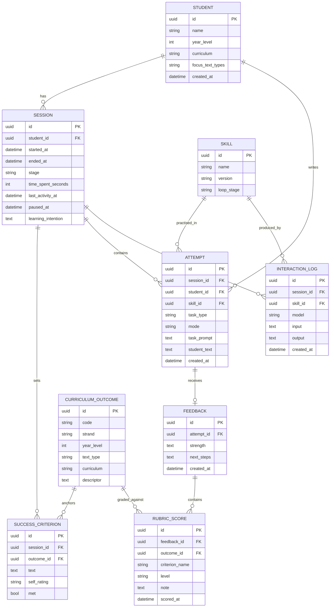
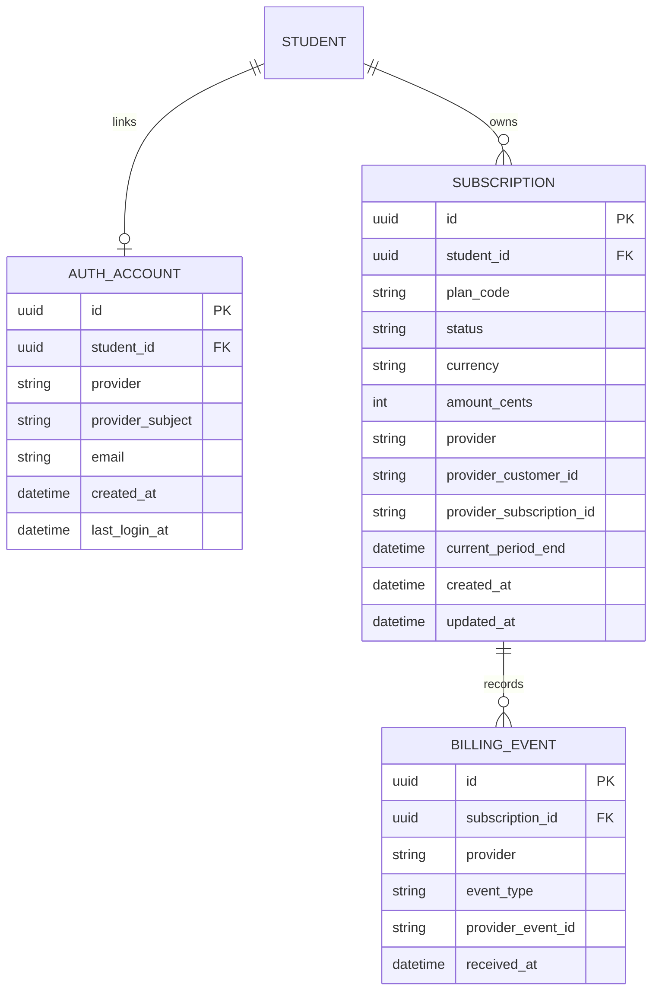

# English Tutor — ERD (MVP baseline + GA delta)

> Data model for the local MVP, updated for the current code, plus the GA public paid product delta. The V1 schema remains small and local-first; the GA section records the auth, billing, and hosted-multi-user extensions required when the product becomes public. Multi-user is reserved in V1 but not exercised until GA.

Last updated: 2026-08-19

## Diagram

```mermaid
erDiagram
    STUDENT ||--o{ SESSION : has
    STUDENT ||--o{ ATTEMPT : writes
    SESSION ||--o{ SUCCESS_CRITERION : sets
    SESSION ||--o{ ATTEMPT : contains
    SESSION ||--o{ INTERACTION_LOG : records
    ATTEMPT ||--o| FEEDBACK : receives
    FEEDBACK ||--o{ RUBRIC_SCORE : contains
    CURRICULUM_OUTCOME ||--o{ SUCCESS_CRITERION : anchors
    CURRICULUM_OUTCOME ||--o{ RUBRIC_SCORE : graded_against
    SKILL ||--o{ ATTEMPT : practised_in
    SKILL ||--o{ INTERACTION_LOG : produced_by

    STUDENT {
        uuid id PK
        string name
        int year_level
        string curriculum
        string focus_text_types
        datetime created_at
    }
    CURRICULUM_OUTCOME {
        uuid id PK
        string code
        string strand
        int year_level
        string text_type
        string curriculum
        text descriptor
    }
    SKILL {
        uuid id PK
        string name
        string version
        string loop_stage
    }
    SESSION {
        uuid id PK
        uuid student_id FK
        datetime started_at
        datetime ended_at
        string stage
        int time_spent_seconds
        datetime last_activity_at
        datetime paused_at
        text learning_intention
    }
    SUCCESS_CRITERION {
        uuid id PK
        uuid session_id FK
        uuid outcome_id FK
        text text
        string self_rating
        bool met
    }
    ATTEMPT {
        uuid id PK
        uuid session_id FK
        uuid student_id FK
        uuid skill_id FK
        string task_type
        string mode
        text task_prompt
        text student_text
        datetime created_at
    }
    FEEDBACK {
        uuid id PK
        uuid attempt_id FK
        text strength
        text next_steps
        datetime created_at
    }
    RUBRIC_SCORE {
        uuid id PK
        uuid feedback_id FK
        uuid outcome_id FK
        string criterion_name
        string level
        text note
        datetime scored_at
    }
    INTERACTION_LOG {
        uuid id PK
        uuid session_id FK
        uuid skill_id FK
        string model
        text input
        text output
        datetime created_at
    }
```

## Entities

- **student** — the learner. Multi-user ready; V1 has one/few local rows. `focus_text_types` stores the student's chosen practice priorities as a JSON-encoded list.
- **curriculum_outcome** — a curriculum outcome/descriptor (strand, year, text type, curriculum). Year 8 QCAA analytical is filled first; 9–12 and other curricula are added later.
- **skill** — registry entry for each agent skill (name, version, loop stage). The behaviour lives in the `skills/` files; this table lets attempts/logs reference which skill + version ran.
- **session** — one practice session; holds the learning intention and the interactive stage machine state. `time_spent_seconds`, `last_activity_at`, and `paused_at` support the fixed-time lesson budget and pause/resume behaviour.
- **success_criterion** — the "I can…" criteria for a session, anchored to an outcome, with the student's self-rating.
- **attempt** — a piece of student writing (paragraph or timed mock), tied to the skill practised.
- **feedback** — the coaching response for an attempt: one strength + the 1–2 next steps.
- **rubric_score** — **the North Star table.** One row per criterion per graded attempt: `criterion_name` + `level` (A–E) + timestamp. Progress = these rows over time.
- **interaction_log** — every LLM turn (input, output, model), for replay and the eval harness.

## Key queries this supports

- **North Star:** `rubric_score` filtered by `student` + `criterion_name`, ordered by `scored_at` → the A–E progression curve per criterion.
- **Weekly mock trend:** `attempt.mode = 'assessment'` joined to its `rubric_score`s.
- **Replay/eval:** `interaction_log` by `skill_id` + `model` → re-score against golden expectations.
- **Pause/resume:** active `session` by `student` + `paused_at` / `last_activity_at`, with `time_spent_seconds` compared against the configured lesson budget.

## Privacy & retention (minor's data)

- All V1 tables live in the local database (SQLite MVP). Nothing persisted off-machine.
- `student_text`, `feedback`, and `interaction_log` hold the child's writing — treat as sensitive.
- **Deletion:** deleting a `student` cascades to sessions, attempts, feedback, scores, and logs. Provide a "delete my data" path from day one.
- Cloud LLM may *process* `student_text` in transit (per `PRD.md` §6) but must not be used to persist or train on it.
- **GA note:** when the product becomes public paid, persistence moves from local-only to hosted. The same minor-data principles still apply: minimal retention, no third-party analytics on student content, explicit deletion, and clear cloud-LLM processing boundaries.

## Prod-readiness notes

- UUID PKs and a `student_id` on session/attempt make multi-tenant migration clean.
- SQLite → Postgres: types chosen to port directly (uuid, datetime, text, int, bool).
- `skill.version` lets us correlate quality changes with skill edits.
- The interactive session fields (`stage`, `time_spent_seconds`, `last_activity_at`, `paused_at`) are lightweight SQLite migrations in V1; GA should move these into formal migrations.
- V1 does **not** create auth, subscription, or billing tables; those are GA deltas below.

## GA public paid product delta (planned, not in V1 schema)

The V1 local schema stays the source of truth for current development. For GA, the hosted product adds identity, subscription, and billing-reference tables while preserving the existing teaching tables as the system of record for learning data.

### Planned GA entities

```mermaid
erDiagram
    STUDENT ||--o| AUTH_ACCOUNT : links
    STUDENT ||--o{ SUBSCRIPTION : owns
    SUBSCRIPTION ||--o{ BILLING_EVENT : records

    AUTH_ACCOUNT {
        uuid id PK
        uuid student_id FK
        string provider
        string provider_subject
        string email
        datetime created_at
        datetime last_login_at
    }
    SUBSCRIPTION {
        uuid id PK
        uuid student_id FK
        string plan_code
        string status
        string currency
        int amount_cents
        string provider
        string provider_customer_id
        string provider_subscription_id
        datetime current_period_end
        datetime created_at
        datetime updated_at
    }
    BILLING_EVENT {
        uuid id PK
        uuid subscription_id FK
        string provider
        string event_type
        string provider_event_id
        datetime received_at
    }
```

### Planned field extensions to current entities

- `student.school_feedback_focus` — JSON/text list of school-reported priorities, distinct from product-chosen `focus_text_types`.
- `student.timezone` — needed for hosted streaks, weekly goals, and lesson time windows across Australia.
- `session.time_limit_seconds` — optional per-session override of the global lesson budget; V1 uses config-level `SESSION_TIME_LIMIT_MINUTES`.
- `curriculum_outcome.state_or_system` — explicit QCAA/NESA/other-state ownership once coverage expands beyond Queensland.

### Requirement traceability

| PRD requirement | Engineering decision | Verification approach |
|---|---|---|
| FR-GA-001 Google sign-in | Add `auth_account` keyed by `(provider, provider_subject)`; link one student to one login identity for first version. | OAuth callback test creates/links account; second login returns same student. |
| FR-GA-002 student profile | Extend `student` with school feedback focus/timezone; keep profile editable. | API schema test + profile round-trip test. |
| FR-GA-003 subject selection | Keep `curriculum_outcome` as subject/text-type catalogue; add seeds before claiming coverage. | Seed test asserts supported combinations; session start rejects unsupported combo with a clear error. |
| FR-GA-004 private progress/history | Preserve `student_id` ownership on session/attempt/feedback/score/log; hosted API scopes every query by authenticated student. | Authorization test: student A cannot read student B progress/history. |
| FR-GA-005 AUD 9.9/month subscription | Add `subscription` + `billing_event`; teaching access checks subscription state but never teaching logic. | Webhook tests for active/past_due/canceled; access gate test. |
| FR-GA-006 fixed-time pause/resume | Keep V1 session time fields; GA adds optional per-session limit. | Time-budget tests already exist; add override test. |
| FR-GA-007 hosted deletion | Cascade learning data; detach/anonymize auth and billing references subject to provider/legal constraints. | Deletion test proves learning data is gone and auth/billing rows are handled explicitly. |
| NFR-GA-001 1000 users | Postgres, stateless API, externalized session ownership, slow-LLM isolation/queue strategy. | Load/smoke test before public launch; no redesign of skill execution contracts. |

### Deployment, migration, and rollback

- **V1:** local SQLite via `docker compose up`; schema changes may use lightweight idempotent patches.
- **GA:** hosted Postgres with formal migrations; SQLite remains a dev/local compatibility path where practical.
- **Migration:** move from local/per-family installs to hosted by export/import first; do not silently sync minor data.
- **Rollback:** billing or auth rollout must be feature-flagged so the teaching loop can fall back to a safe access state without losing student writing.

## Open technical decisions

- **TD-GA-001:** Billing provider for AUD subscriptions (Stripe vs Paddle) and tax/invoicing obligations.
- **TD-GA-002:** Google OAuth flow for a hosted FastAPI/React app and whether parents can manage a child's subscription.
- **TD-GA-003:** Public deployment target and data-residency posture for Australian families.
- **TD-GA-004:** Source of truth for the Australian secondary English exam subject/text-type catalogue beyond QCAA.
